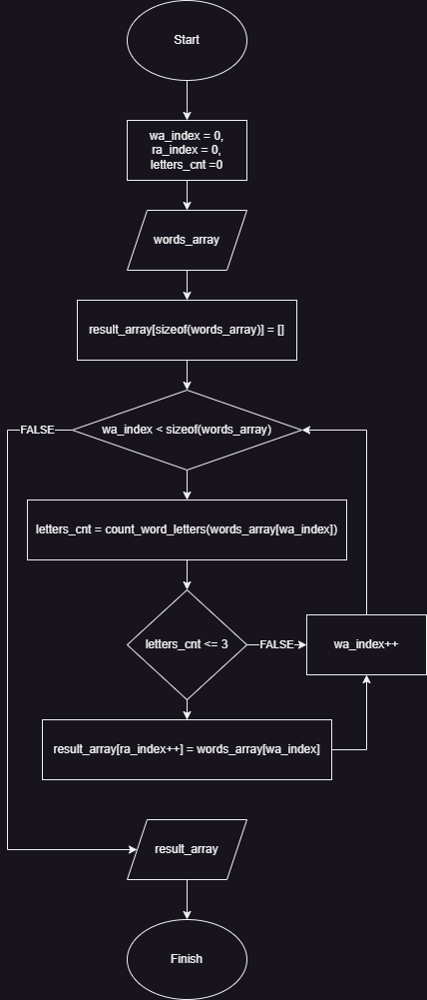

# Итоговая контрольная работа по основному блоку

Данная работа необходима для проверки знаний и навыков по итогу прохождения первого блока обучения на программе Разработчик. GB должны убедится, что базовое знакомство с IT прошло успешно.

## &#128195; ЗАДАЧА
Написать программу, которая из имеющегося массива строк формирует новый массив из строк, длина которых меньше, либо равна 3 символам. Первоначальный массив можно ввести с клавиатуры, либо задать на старте выполнения алгоритма. При решении не рекомендуется пользоваться коллекциями, лучше обойтись исключительно массивами.

## Требования

1. Создать репозиторий на GitHub
2. Нарисовать блок-схему алгоритма (можно обойтись блок-схемой основной содержательной части, если вы выделяете её в отдельный метод)
3. Снабдить репозиторий оформленным текстовым описанием решения (этот файл README.md)
4. Написать программу, решающую поставленную задачу
5. Использовать контроль версий в работе над этим небольшим проектом (не должно быть так, что всё залито одним коммитом, как минимум этапы 2, 3, и 4 должны быть расположены в разных коммитах)

## Copyrights

2024 &copy; Траторов Н.Ю. aka NiX

---

## &#128230; РЕШЕНИЕ

### 1. Репозиторий

[Ссылка на Github](https://github.com/nixprosoft/gb_exam_1)

### 2. Блок-схема

### 3. Текстовое описание

*Вы его сейчас читаете* &#128516;

### 4. Написать программу